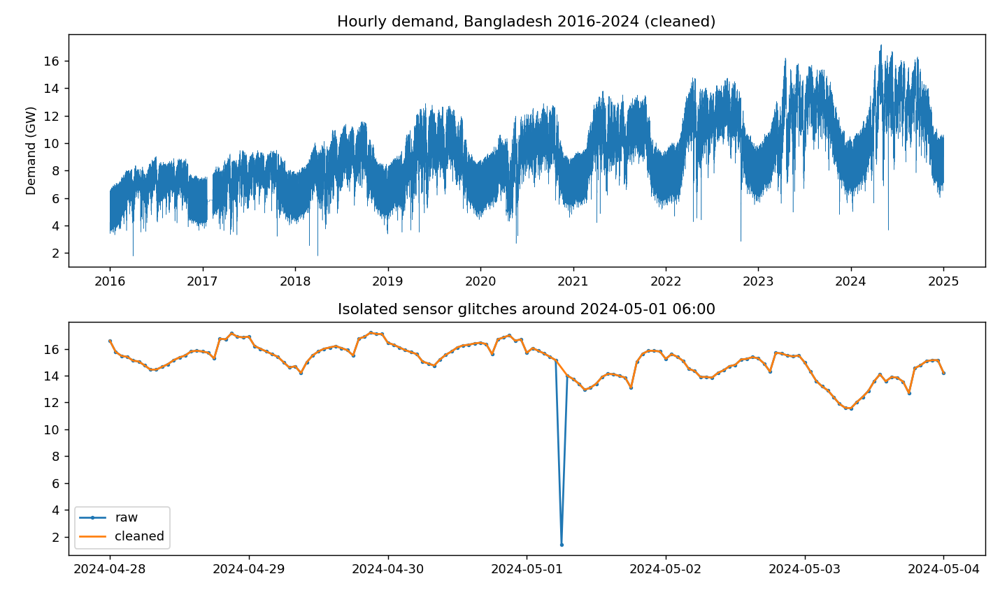
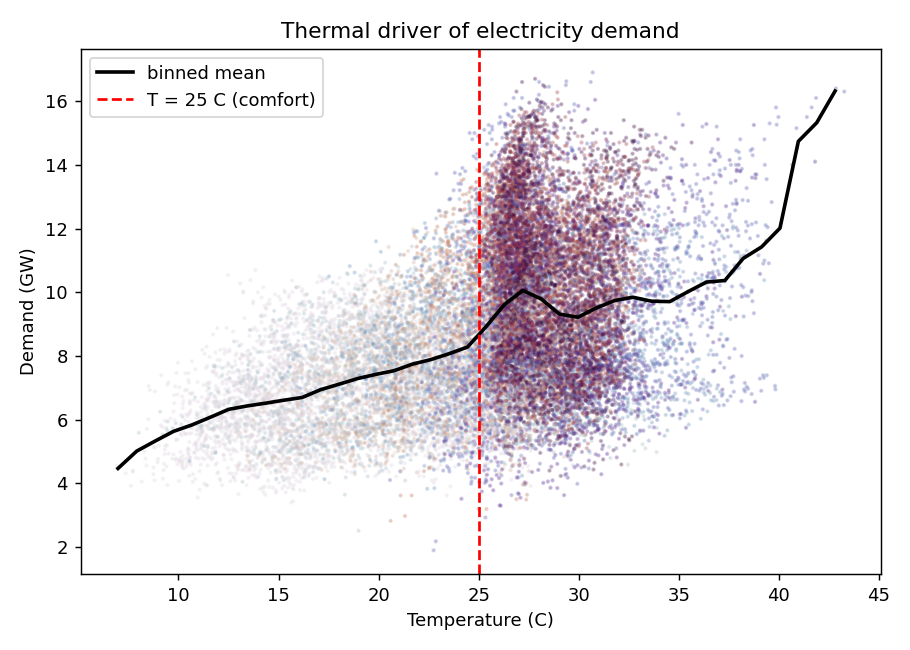
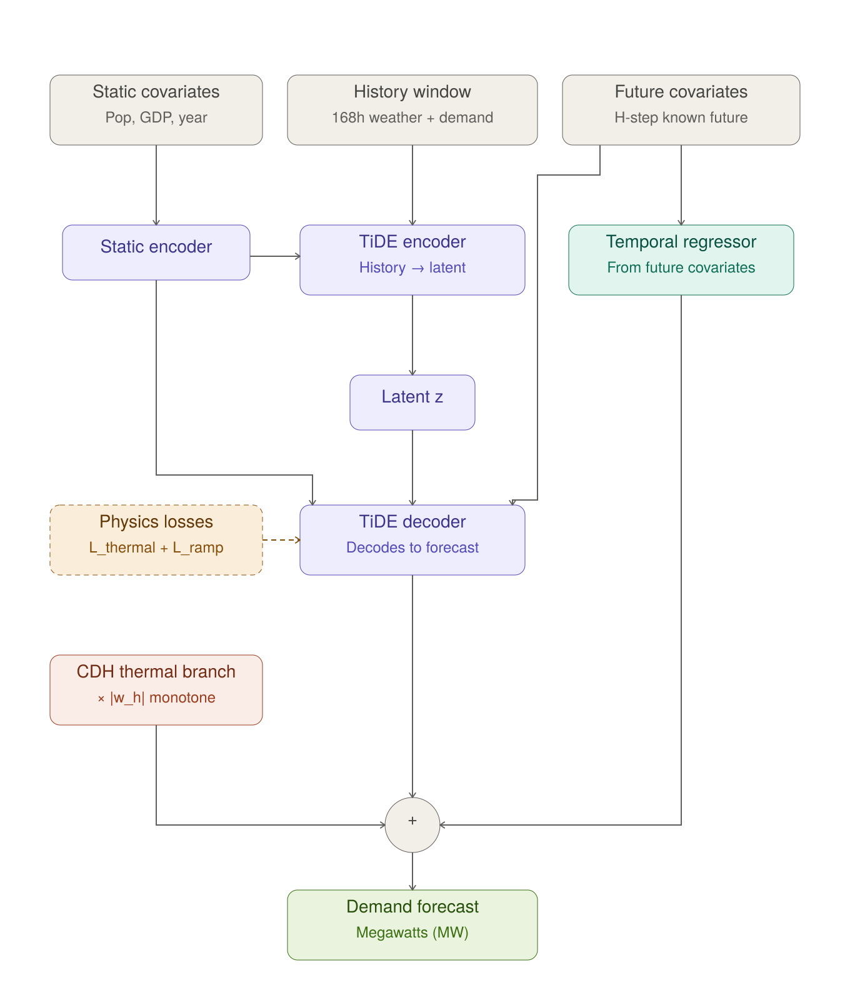
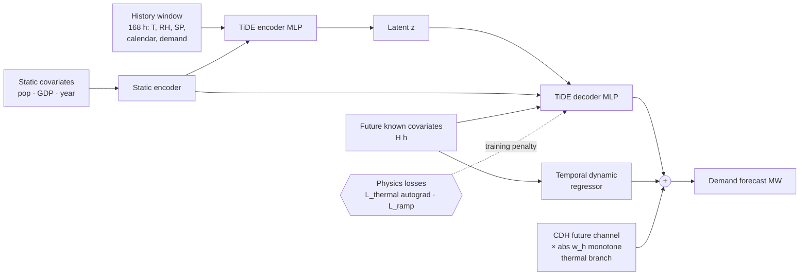
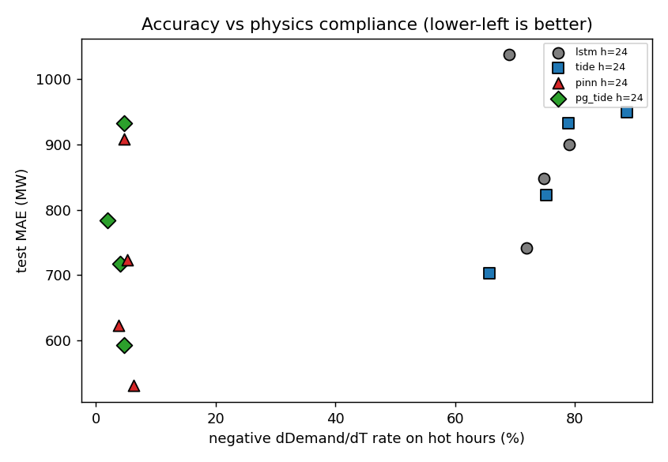
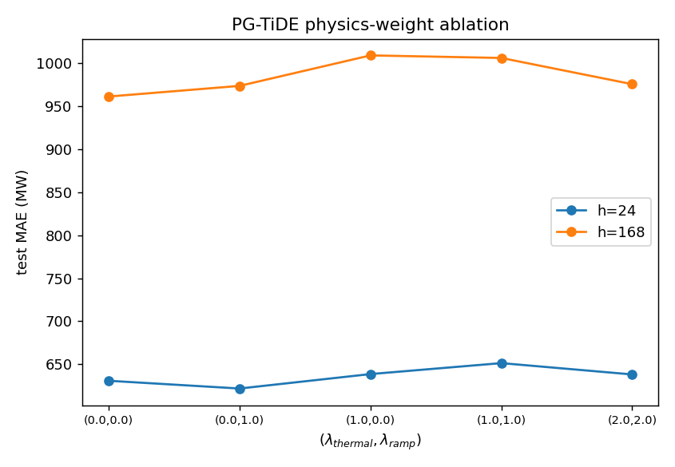

<div align="center">

# PITiDE: Physics-Informed TiDE for Electricity Demand Forecasting

### Physics-Guided TiDE (**PG-TiDE**) & PINN forecasting of the Bangladesh national grid

[](LICENSE)&nbsp;
[](https://www.python.org/)&nbsp;
[](https://pytorch.org/)&nbsp;
[](#running-on-kaggle-gpu)&nbsp;
[](https://numpy.org/)&nbsp;
[](https://pandas.pydata.org/)&nbsp;
[](https://optuna.org/)&nbsp;
[](https://github.com/psf/black)&nbsp;
[](BangladeshData_2016_2024.csv)&nbsp;
[](#citation)

> **TL;DR** — Adding two grid-physics penalties (thermal sensitivity `∂D/∂T ≥ 0` in
> the hot regime + generator ramp-rate limits) to TiDE beats the vanilla backbone
> at *every* horizon (MAE **−1.8% … −16.0%**) while cutting unphysical
> temperature responses from **66–89% → 2–5%** of hot hours. The PINN variant is
> the most accurate model overall (MAPE **4.9%** @ 24 h).

</div>

---

## 📌 Contents

- [Why physics?](#-why-physics)
- [Dataset](#-dataset)
- [Problem setting](#-problem-setting)
- [Method](#-method) · [PG-TiDE architecture](#-pg-tide-architecture)
- [Models](#-models)
- [Results](#-results)
- [Setup & experiments](#-setup--experiments)
- [Repository layout](#-repository-layout)
- [Citation](#-citation)
- [Limitations](#-limitations)

## 🔥 Why physics?

Aggregate electricity demand has no governing PDE, and the supplied
`Generation(MW)` column turned out to be a **71%-duplicate of `Demand(MW)`** —
so a power-balance constraint is impossible (see [data quality](#-dataset)).
Instead, physics enters as *differentiable soft priors*, the standard framing
in PGNN load-forecasting literature, via autograd through the model inputs:

| | constraint | rationale | penalty |
|---|---|---|---|
| **L_thermal** | `∂Demand/∂T ≥ 0` when `T > 25 °C` | AC-driven load: hotter ⇒ more demand | `relu(−∂ŷ/∂T)`, autograd |
| **L_ramp** | `|ΔDemand| ≤ R_max` per hour | physical generator ramping limits | `relu(|Δŷ| − R_max)` |

```
L = MSE(ŷ, y) + λ_thermal · L_thermal + λ_ramp · L_ramp
```

`CDH = relu(T − 25)` is computed *inside* every model forward, so gradients
flow through the physics feature as well (PyTorch autograd — the "PINN" part).

## 📊 Dataset

`BangladeshData_2016_2024.csv` — 78,912 rows, complete hourly grid
(2016-01-01 → 2024-12-31; no gaps / duplicates / NaNs).

| column | role |
|---|---|
| `Datetime` | timestamp |
| `Temperature(2m)`, `Rhumadity(2m)`, `SPressure(kPa)` | known-future weather covariates |
| `Population`, `GDP` | static (yearly) covariates |
| `Demand(MW)` | **forecast target** |
| `Generation(MW)` | **excluded** — identical to `Demand(MW)` in 71.0% of rows |

<details>
<summary><b>Data-quality findings</b> (74 sensor glitches, peak 9→17 GW, 64.6% hot hours)</summary>

- 74 isolated sensor glitches (e.g. a single hour at **143 MW inside a 13.5 GW
  series**) removed via median-ratio + jump-reversal detection and interpolation.
- Annual peak demand grows **9.0 GW (2016) → 17.2 GW (2024)**.
- **64.6%** of all hours exceed the 25 °C comfort threshold — a strongly
  thermal-driven, AC-dominated load profile, which is exactly the regime where
  the thermal prior applies.
- Full evidence: run `python src/eda.py` → `results/data_quality.txt` + figures.

</details>




## 🎯 Problem setting

Multi-horizon pure forecasting: given the last `L = 168` h of demand + weather
plus calendar/static covariates, predict `H ∈ {24, 48, 72, 168}` h.

- **Chronological split** — train 2016–2022, validation 2023 (early stopping +
  hyperparameter selection), test 2024 (single final evaluation, rolling
  non-overlapping windows).
- Future weather is ground truth (perfect-weather-forecast setting, standard
  for short-term load forecasting).
- Metrics: MAE, RMSE, MAPE, sMAPE, peak-hour (18–22 h) MAE, plus **physics
  diagnostics**: negative-sensitivity rate and ramp-violation rate.

## 🧠 Method

### PITiDE / PG-TiDE flow chart



<details>
<summary>Machine-readable architecture spec (Mermaid source, matches <code>src/models/</code>)</summary>



CDH (`relu(T−25)`) is computed inside the forward pass, the static vector is
*added* to encoder/decoder hidden layers, the temporal dynamic regressor is a
parallel additive branch, and the physics losses act during training only.

</details>

Two mechanisms distinguish **PG-TiDE** from vanilla TiDE:

1. **Structural** — an additive monotone thermal branch `CDH_future · |w_h|`
   that *cannot* decrease output when temperature rises.
2. **Variational** — both physics penalties added to the training loss.

Setting `λ = 0` and `w = 0` collapses to a clean ablation ladder
(structural-only / loss-only / full).

## 🤖 Models (`src/models/`)

| name | description |
|---|---|
| `seasonal_naive` | `y(t+h) = y(t+h−168)` |
| `lstm` | LSTM baseline with future-covariate projection |
| `tide` | TiDE (Rasul et al., 2023): static encoder, flattened-MLP encoder/decoder with residual blocks, temporal dynamic regressor |
| `pinn` | MLP forecaster trained with the physics losses (PINN-style variational constraint) |
| `pg_tide` | **PG-TiDE (our contribution)** — TiDE + structural thermal branch + physics losses |

## 📈 Results

Kaggle GPU (CUDA), Optuna-tuned configs (`--use-tuned`), 2024 test, mean of 3 seeds:

| model | h=24 | h=48 | h=72 | h=168 | neg. dD/dT (hot h) |
|---|---|---|---|---|---|
| Seasonal-Naive | 1318–1324 | 1321 | 1324 | 1324 | — |
| LSTM | 741 | 848 | 900 | 1037 | 69–79% |
| TiDE | 703 | 822 | 933 | 950 | 66–89% |
| **PINN** | **531** | **623** | **723** | **908** | 3.7–6.3% |
| **PG-TiDE** | 593 | 717 | 784 | 933 | **1.9–4.8%** |

*Test MAE (MW). h=24 detail: PINN MAPE 4.87% / RMSE 774 vs TiDE 6.27% / 936.*




**Key findings**

- ✅ **PG-TiDE beats vanilla TiDE at every horizon** (−15.7% / −12.7% / −16.0% /
  −1.8% MAE); at h=72 guidance lifts TiDE from *below* LSTM to well above it.
- ✅ **PINN is the most accurate model overall** with the lowest seed variance
  (MAE sd 18–55 vs 35–108 MW) — physics regularization stabilizes learning.
- ✅ Physics cuts unphysical negative temperature response **~15–45×**.
- 🔬 **λ-ablation**: `λ_thermal` drives compliance *and* stability; `λ_ramp` is
  near-inert on accuracy (ramp violations were already <0.02%) — an honest
  safety prior rather than a performance trick.
- ⚖️ Tuned `λ ≈ (0.2, 0.7)` maximizes accuracy; larger `λ` buys more compliance
  (negsens 0.6% at λ=2) — report both axes or tune multi-objectively.

## 🛠️ Setup & experiments

```bash
pip install -r requirements.txt
# CPU-only local torch:  pip install torch --index-url https://download.pytorch.org/whl/cpu
```

**GPU support:** tested on Kaggle T4 and P100 (compute capability 6.0, within
the sm_50+ range of prebuilt CUDA wheels); device auto-detected via
`torch.cuda.is_available()`. RNN sensitivity diagnostics run with cuDNN
disabled, bypassing the "cudnn RNN backward in eval mode" limitation. Note
per-seed numbers vary slightly across GPU models — keep one accelerator for
the final paper tables.

### Running on Kaggle GPU

```python
!git clone https://github.com/Nripendrobiswas/PITIDE_TRASH.git
%cd PITIDE_TRASH
!pip install -q optuna
!python src/tune.py --all --horizon 24 --trials 15    # val-MAE objective (never touches test)
!python src/train.py --all --use-tuned                # full matrix + λ ablation, resumable
!python src/report.py                                 # tables + figures -> results/
```

### Single runs & knobs

```bash
python src/train.py --model pg_tide --horizon 72 --seed 1 --lam-t 2 --lam-s 1
python src/train.py --all            # resume-safe: completed rows in results/metrics.csv are skipped
python src/tune.py --model lstm --horizon 24 --trials 10
```

Search space (per model): `hidden`, `latent`, `n_res_blocks` / LSTM `layers`,
`dropout`, `lr` (log-uniform), `batch_size`, `weight_decay` (log-uniform), and
for physics models `λ_thermal, λ_ramp ∈ [0.05, 5]` (log). Best configs merge
into `results/best_params.json`.

## 🗂️ Repository layout

```
├── BangladeshData_2016_2024.csv      # dataset
├── assets/                           # README figures
├── requirements.txt · LICENSE
├── notebooks/01_eda.ipynb
├── src/
│   ├── config.py                     # all defaults (paths, horizons, λ, training)
│   ├── data_pipeline.py              # cleaning, features, zero-copy windowing, splits
│   ├── physics.py                    # L_thermal (autograd), L_ramp, violation diagnostics
│   ├── models/{common,tide,pg_tide,pnn,baselines}.py
│   ├── train.py                      # trainer / rolling test eval / resumable matrix
│   ├── tune.py                       # Optuna TPE (random-search fallback)
│   ├── evaluate.py · report.py · eda.py
└── results/                          # generated (untracked): metrics, tables, figures
```

## 📝 Citation

```bibtex
@misc{pitide2026,
  title  = {Physics-Guided TiDE: Embedding Grid Physics in Deep Hourly
            Electricity Demand Forecasting},
  author = {Biswas, Nripendro},
  year   = {2026},
  note   = {Preprint. Code:
            https://github.com/Nripendrobiswas/PITIDE_TRASH},
}
```

TiDE backbone: Rasul et al., *"TiDE: Time-series Predictive Deep Model for
Forecasting with Exogenous Inputs"*, 2023 (arXiv:2304.08424).

## ⚠️ Limitations / honest caveats

- "Physics" = soft-constraint priors (thermal monotonicity, ramp limits), not a
  conservation law — a power-balance term was impossible because the supplied
  `Generation(MW)` column duplicates `Demand(MW)` in 71% of rows.
- Horizon weather is observed ground truth (no forecast-error modeling).
- Single grid (Bangladesh); external validity beyond hot, AC-dominated load
  profiles untested.

## 📄 License

Released under the [Apache License 2.0](LICENSE).
